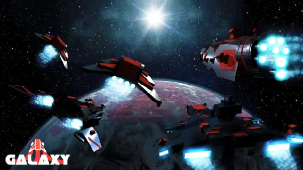

# Administrator Guidelines

<figure markdown="span">
    { loading=lazy }
</figure>

/// admonition | Work in Progress
    type: danger
This guide is still being actively worked on, and is not quite ready yet.
///

## Administrative Duties

Admins monitor in-game activity to ensure fair gameplay and relative peace within the in-game chats. When refunds need to be processed, these staff members typically handle them but may request support from devs in special circumstances, depending on what happened. These instances, however, are few and far between.

Sometimes, Admins may host what are referred to as “Admin Events” where an entire server of players are united to participate in a unique event not found in normal gameplay, and often comes with reasonable rewards, but are also highly risky to participate in.

They may also involve giveaways that have rewards “poofed” in or given away by other community members, and will always involve admin ships that have zero weaponry, unless the giveaway is done via the Discord, which is then done by a bot in the server.

## Introduction

Galaxy was first introduced to Roblox on 1/13/2015 and with it, has seen a long history of updates, history, joy and anger. From the first player created clans such as OP (Otaku Pirates), OP18 (Outpost 18), ToS (Titans of Space) to the later clans such as Lunar Cloud, PMC and a few others, there is a lot of information that the Administration Team has to be aware of, understand and discuss for everything done. Some refunds done follow the guidelines created in the time period where the kill happened, which could date years back, and it is the Admin’s job to understand those past guidelines and be flexible enough to work within them when needed, while still conforming to the current standards created by the Admin Director at the time.

## Staff Roles

- Administrator
    - Community Members entrusted with authority that affects players’ stats in various ways ingame. These players enforce ingame rules on both the ingame chat and ingame actions utilizing various tools at their disposal. They can also host “Admin Events” that can bring something different than the standard gameplay loop and have decent rewards, but also come with a higher risk.

- Lead Administrator
    - A more trusted administrator given significantly more commands and power that can greatly affect other players on a serious level, such as transfers and total account wipes. This player co-leads the Admin Team as a whole alongside the Admin Director.

- Admin Director
    - The current Head of the Administrative Team, this player primarily leads the admin team, creating rules and policy as needed, opens administrative nominations, and works with the Dev Director and the Game Owners to oversee the game’s viability.

- Developer
    - A member of staff who is focused primarily on the future development of Galaxy. Developers are responsible for creating events, balancing gameplay and working on future updates.

- Core Scripter
    - Core scripters are trusted developers in the development team with coding knowledge, they are in a position of privilege and trust which enables them to directly edit some of Galaxy's core code. This role is given out exclusively by yname and Rcouret.

- Dev Director
    - Oversees the Dev Team as a whole and can issue requests to the Admin Team for certain things to be handled, such as final rounding or shutting down servers as needed.

- Game Owner
    - The Current owner of Galaxy (yname) has full leadership over the Admin and Dev teams as needed.

- Original Game Owner
    - The original creator of Galaxy, this role is reserved only for rcouret. (test)

## Ingame Rules Currently Enforced
- 1: Follow the Roblox TOS
- 1a: TBD
- 2: Placeholder
- 3: Placeholder
- 4: Placeholder
- 5: Placeholder
- 6: Placeholder
- 7: Placeholder
- 8: Placeholder
- 9: Placeholder
- 10: Placeholder
- 11: Placeholder
- 12: Placeholder
- 13: Placeholder
- 14: Placeholder

## The Moderating System

The new moderation system will run differently than before. There are two different variants to the system, one is for ingame actions, and the other is for the chat. Every person will have essentially a twenty (20) point limit on both systems, where certain infractions generate more than others. These points drop off after a certain amount of time, except in more serious cases such as the Forbidden Violations. At a certain level of points, you will receive warnings for your actions. Then you’ll receive bans, and ultimately permanent bans. There will no longer be a procedure of essentially going back and forth between moderation types. Instead, they’ll all accumulate towards a collective score.

All users will have a 20 point limit on ingame infractions, and chat infractions. Four points drop off after 4 weeks once the most recent infraction runs its course (ie 14d ban starts and ends, the timer begins.)

Minor Infractions of both types will incur one (1) point.
Major Infractions of both types will incur five (5) points.

Ingame Points: 1 (Warning), 5 (3d Ban), 12 (7d Ban), 16 (14d Ban) 18 (Perm Ban, Appealable), 20 (Perm Ban, Unappealable)

Chat Violations: 1 (Warning), 5 (3d Chat Ban), 10 (7d Chat Ban), 15 (14d Chat Ban), 18 (Perm Ban, Appealable), 20 (Perm Ban, Unappealable)
Minor Infractions

## Minor infractions are small-scale issues that do not require admins to be present to handle, though they can handle the issue afterwards. 

 Some infractions, but not limited to, are the following:

- Chat Flood
- Accidental Dock Block
- Bypassing Chat Filter
- NSFW References
- Warp Ramming
-
-
-
## Major Infractions

 These infractions have a more serious impact on gameplay, oftentimes requiring direct admin involvement to remedy, such as deliberate dock block resulting in death, harassment, self-harm encouragement, and more.

Some Examples of this list are as follows, but are not limited to:

- Deliberate Dock Block
- Harassment
- Bullying
- Suicide Encouragement
- NSFW Messages (Not References, actual NSFW)
- NSFW Advertisements
- NSFW Team names
- 
- 
- 
- 
## Forbidden Infractions

 These are the worst offenses one could commit, and they almost always result in immediate, unappealable permanent bans. They can also result in chase bans that are unappealable.

Some examples, but not limited to, are as follows:

- Doxxing
- Black Marketing Accounts
- Sending Unsolicited Gore
- Breaking Roblox TOS
- Breaking Discord TOS (In certain areas only, such as selling exploits)
- Phishing
- Account Data Theft
- 
- 
- 
- 
- 
## Variable Infractions

 Placeholder
## Variable Infractions Explained

 Placeholder
## The Old and Current Known Exploits

 Placeholder

## Refunding Procedures

Refunds are a common place within the Galaxy/Support Discord, and admins will process them whenever they have free time and are up for it. Refunds pending by community members are not open to be commented on by other players with the exception of adding new evidence to further support the refund, and should be done so via a reply. Staff may reply asking for information or comment on the refund in a professional manner. However, staff prefer the refund to have all evidence in a single message for easy logging.

For a refund to be accepted, it must have the server version and map fully visible at all times, including the proof of why a refund should take place. I.E. A Frostpocalypse is being dockblocked, the full screen shall be shown so that staff can effectively determine the outcome while limiting possibilities of falsified evidence being present.

Here’s a short list of possible reasons a refund could be processed also known as accepted, though a more concise list is on the page dedicated to Refund Reasons.

1: Dock block
2: Disconnected
3: Bugs
4: Flings

All accepted/denied videos must be logged publicly with all relevant information, as well as in the proper admin channels dedicated to them. All commands must also be logged. 

In certain cases, the AD/LA may determine a refund can be accepted/denied but the evidence is not posted. These are because of serious issues such as potential self doxes or other reasons along the same lines. This will be listed in the reasoning as well.

## Account Resets
When users are caught using an exploit known as Automining, they are permanently banned. The only way to truly appeal this ban is via an account reset, applicable only by the LA and AD. This means ALL ACCOUNT DATA ON GALAXY is wiped, and you start anew with only the starting ships and warehouse. However this isn’t only just a punishment. Sometimes users just want to start anew, with this they can request a quick and simple account wipe, and they start from scratch.

## Account Transfers
Account transfers are as the name suggests, the transfer of one’s data account (further known as transferer) to another account (further known as transferee). To process this, either the transferer or transferee must purchase the “Account Transfer” gamepass for its fee and then make an AD/Account Transfer ticket in the support server. If the transferer or transferee do not own both accounts involved, the AD and LA are responsible for ensuring both account owners are present and give consent with full understanding that all data is transferred over and the transferer account will be back to day one in terms of stats. Account Transfers are private and may not be leaked by staff unless the transferer/transferee reveal it themselves. Any duplicated info (i.e. both accounts have a Galaxy) is lost permanently as it will simply cease to exist, so be sure to try to avoid it if at all possible. Something worth noting is that the Admin Director is capable of denying account transfers if they feel it suspicious or any other possible issue. When you buy the account transfer, you have already agreed to that disclaimer.

In the case of a falsified Account Transfer, i.e. someone steals the account or claims ownership but does not actually own it, the transferer will be fully banned with no appeal, and the transfer is reversed.
Common Accepted/Denied Refund Reasons
Placeholder

## Disconnection Refunds

