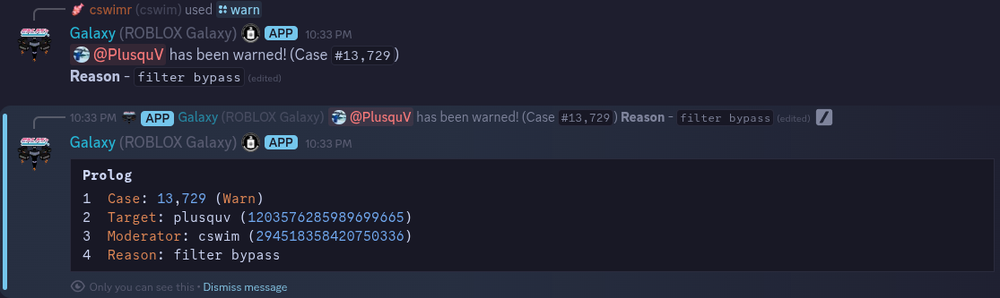
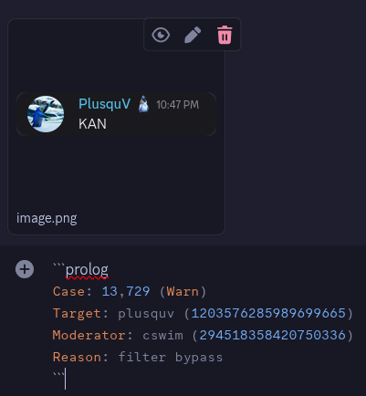

# Galaxy Discord Moderation Guidelines

This community is based around the Roblox game **[Galaxy](https://roblox.com/games/12426862174 "Roblox - Galaxy")**. This means that our standards on the Discord cannot be any lower than our standards in-game. You are expected to be professional, independent and mature. Your job is to enforce rules, and these guidelines will explain how.

**Trial Moderators**, direct any questions to the other Moderators. They have experience and will help to support and guide you.  
**Moderators**, direct any questions to the Mod Manager.

/// admonition | Work in Progress
    type: danger
This guide is still being actively worked on, and is not quite ready yet. Report any issues to @cswim on Discord.
///

## Trial Moderators

Every Moderator begins as a Trial Moderator. It is not just a role, but a period of time in which the Mod Manager will closely oversee all of your actions and determine if you are fit to be a Moderator. This evaluation period lasts for 14 days. On the final day of your evaluation period, the Mod Manager will go through your activity and determine if you should be promoted or let go. The Mod Manager may remove you before the period is up for other reasons, such as abuse of power. Questions are to be expected from you, do not be afraid to ask for help!

/// admonition | Trial Moderator Permissions
    type: info
Trial Moderators do not have the required permissions to ban or kick users. Please ask a Moderator to handle that if you're certain that a particular member deserves a ban. If you cannot wait for a response, you may shortmute the rulebreaker for up to 30 minutes so they don't cause any more trouble.
///

## Moderators

After passing your Trial Moderator evaluation period, you will be given the Discord Moderator role. As a Moderator, you have the ability to warn, mute, kick, and ban problematic community members. More permissions are not the only change, you will also have responsibilities to fulfill. You will be expected to enforce the Discord server's rules, according to what is outlined in these Guidelines.

### Duties

As a Moderator, you are expected to perform the following duties when required. This is on top of moderating rulebreakers.

- Ranking community members who make a valid request in the `#!cpp #role-request` channel.
    - Delete their request after adding their role.
- Posting advertisements in the `#!cpp #group-advertising` channel, assuming the following criteria are met.
    - The advertised Discord server:
        - **must not** contain any content that breaks the Galaxy discord server's rules in any channels that can be seen immediately after joining or after some variety of verification process. Channels containing NSFW content are allowed **only if they are marked as Age-Restricted channels within Discord.**
        - **must not** be a community server for another game, and **must not** not claim to be one.
        - **must be** in some way related to Galaxy, whether it's a Galaxy clan or just a group of players who play Galaxy.
        - **must not** be promoting a scam.
        - **must not** encourage the use of or sell exploits or other cheat software / scripts.
        - **must not** be in violation of the Discord **[Terms of Service](https://discord.com/terms "Discord Terms of Service")** or **[Community Guidelines](https://discord.com/guidelines "Discord Community Guidelines")**.
- Helping community members within **[Support Server](https://discord.gg/ShWshkhYhZ "Join the Galaxy Support server on Discord")** Tickets.

### Logging Moderations

When moderating a community member, you are expected to post the following information in the `#!cpp #mod-evidence` channel.

- **Evidence:** Image/video proof of the infraction
    - If the infraction occurred in a voice chat, you must have a video or audio recording of the infraction.
    - If the evidence violates the Discord **[Terms of Service](https://discord.com/terms "Discord Terms of Service")** or **[Community Guidelines](https://discord.com/guidelines "Discord Community Guidelines")**, **do not** post it in the `#!cpp #mod-evidence` channel. This includes things such as NSFW content, as the `#!cpp #mod-evidence` channel is not an Age-Restricted channel.
    - Not providing evidence for a moderation, unless it is a ToS / CG violation, means that the moderation is invalid and may be reverted at the Mod Manager's discretion.
- **Details:**
    - Aurora case ID
    - Your user ID
    - Target's user ID
    - Reason for moderation
    - Duration (if applicable, e.g., for bans/mutes)

/// details | Auto Evidence Format
    type: tip

**[Aurora](https://seacogs.csw.im/aurora "SeaCogs Documentation - Aurora")** automatically generates a pre-formatted moderation log with all required details.

**How to use:**

1. After issuing a moderation action, Aurora will post a summary.
2. **Copy the entire message** and paste it in `#!cpp #mod-evidence`.
3. **Attach your evidence** (screenshots/videos) to the same message.

{ loading=lazy }
{ loading=lazy }

<h3>Extra Details</h3>

- Disable Auto Evidence Format:  

```prolog
-aurora settings overrides
```

- Manually generate a case summary:  

```prolog
/case case:13,729 evidenceformat:True
```

///

### Accountability Clause

As a Moderator, you are entrusted with the authority to exercise professional judgment when addressing behaviors that violate the community's standards, even in situations not explicitly covered by these Guidelines. This discretionary power allows you to take action against harmful conduct that exploits loopholes or operates in gray areas. However, all such decisions must be grounded in observable evidence and the community's best interests, not personal biases or unfounded opinions.

If a moderation action is challenged by the affected user or fellow moderators, the case will be escalated to the Mod Manager for review. During this evaluation period, the original moderation remains in effect. Moderators acting in good faith with proper documentation will not face repercussions even if their decision is ultimately overturned. This protection ensures you can take proactive action without fear of unfair punishment.

When exercising this discretion, always prioritize transparency: thoroughly document your reasoning, preserve all relevant evidence, and when possible, seek input from other Moderators before acting.

### Potential Demotion Reasons

<div class="annotate" markdown>

- Inactivity exceeding one week without leaving a notice first.
    - Inform the Mod Manager of how long you'll be inactive and why.
    <!-- TODO: revisit this policy... I don't know how I feel about this (@cswimr) -->
    - If you are a Trial Moderator, your evaluation period will be extended by however many days you were inactive, according to your inactivity notice. (1)
- Abuse of your powers or continuous false moderations.
    - You will be expected to answer questions about your abuse of power.
    - You may be demoted if the Mod Manager determines that your abuse of power exceeds what is considered a "reasonable mistake."
- Failure to enforce and follow server rules.
    - You are expected to follow both the server's rules and these Guidelines.
    - Your job is to enforce the server's rules. You are not immune to those rules.
- Failure to respect other community members, regardless of their role.
    - You set the example for other community members to follow. Treat people as you want them to treat you; don't be an asshole.
- Over-reliance on guidance after an extended period as a Moderator.
    - Questions are always welcome, but failing to moderate simple things after an extensive duration in your role is not.
- Sharing your Discord or Roblox account.
    - Account sharing is against both of these services' Terms of Services. (2) (3)
    - While we do not punish account sharing for normal players, either on the Discord or in-game, we hold staff to a higher standard.
    - You are responsible for anything that happens on any account(s) you own.
    - Do not, under any circumstances, give another player access to your Discord account or the Roblox account associated with your in-game permissions.
- Sharing confidential information.
    - You are expected to exercise discretion when handling information exclusively available to staff members.
    - Do not share information such as moderation logs, information relating to tickets, in-game player logs / inventories, or chat messages from any staff channels without explicit permission from the relevant department head.
    - If you are provided confidential information from another staff member, consult their department head before redistributing it.

</div>

1. /// admonition
    type: example
If you were given Trial Moderator on the 8th of April, your evaluation period would end on April 22nd. If you announce that you will be inactive for a week, your evaluation period will instead end on April 29th.
///

2. /// admonition | **[Discord Terms of Service](https://discord.com/terms/#4 "Discord Terms of Service - Your Discord Account")** ("Your Discord Account")
    type: quote
*You agree not to license, sell, lend, or transfer your account, Discord username, vanity URL, or other unique identifier without our prior written approval.*
///

3. /// admonition | **[Roblox Terms of Use](https://en.help.roblox.com/hc/en-us/articles/115004647846-Roblox-Terms-of-Use "Roblox Terms of Use")** (User Terms 2b, "Securing an Account")
    type: quote
*You are responsible for maintaining the confidentiality and security of any credentials used to access your Account (e.g., a username and password). You must not share or disclose such credentials to others (except for Guardians in the case of a Minor User).*
///

## Minor Infractions

### Filter Bypasses

- Messages containing blacklisted words are automatically blocked by a Discord Automod filter. Evading this filter warrants moderation.
- Self-censoring is moderated if the intended word is obvious (e.g., `c**t`).
- Reactions/Emojis/Stickers:
    - Combining emojis/reactions to spell out blacklisted words.
    - Using stickers with inappropriate names.
    - Apply the `Blacklist - Reactions` role alongside normal punishment if the infraction involved reactions.

### Toxicity / Trolling

- Instigating conflict, hostility, or arguments.
- Harassment, mild threats, or disruptive behavior.
- Requesting blacklisted roles.

### Spamming / Chat Flooding

- Excessive, repetitive messages or meaningless spam.
    - Do not moderate for walls of text with clear intent (not copypastas).
    - If spam spans multiple channels excessively, treat as [Raiding](#raiding "Forbidden - Raiding").

### NSFW References / Borderline Racism

- Borderline NSFW content (suggestive references/imagery).
- Racially suggestive remarks.

### Glorifying or Joking About Controversial or Tragic Historical Events

- This includes events such as the Holocaust, 9/11, the Beirut explosion, and other controversial or tragic historical events.
    - This is mostly left to the moderator's discretion.

### Advertising

- Advertising is not allowed if the content being advertised is another Discord server or if the content being advertised is unsafe for children, malicious, or breaks other rules.
    - If content violates the Terms of Service of the service it was posted on, report it to that service.
- Community members may submit a Discord server to `#!cpp #group-advertising` by creating a general support ticket in the **[Support Server](https://discord.gg/ShWshkhYhZ "Join the Galaxy Support server on Discord")**. See [Duties](#duties "Moderators - Duties").

### Mention Spamming / Ghost Mentioning

- Mentioning ≥4 users or repeat mentions.
- Ghost mentioning after verbal warnings (from other users/staff).

### Improper Channel Usage

- Posting messages in channels meant for a specific purpose, in a way that disregards that purpose.
    - e.g. posting messages in `#!cpp #refund-request` that are not refunds.
    - If this is a newer member's first offense, consider verbally warning them and deleting their messages instead of moderating them.

### DJ Role Abuse / Music Bypasses

- Posting or playing excessively loud tracks.
- Songs with the explicit intention to bypass.
    - Songs that include a few bypasses are usually allowed as long as the context of the song is not breaking any other rules.
- Apply the `Blacklist - DJ` role alongside normal punishment when punishing for this.

## Major Infractions

### Racism / Discrimination

- Glorifying radical political events in a purposeful attempt to incite disruptions or drama.
- Attacking another community member based on attributes such as their race, national origin, ethnicity, sexual orientation, gender, sex, religious affiliations or disabilities.

### Encouraging Illegal Actions

- Encouraging other community members to commit an illegal action.
    - This includes discussing topics such as drug abuse and underage drinking when those discussions are explicitly encouraging those acts.
    - This is specifically for illegal actions, i.e. actions that violate the law in the country that the victim is in. If the victim's country is unknown, use US law. Use [Violating Discord Terms of Service / Community Guidelines](#violating-discord-terms-of-service--community-guidelines "Forbidden - Violating Terms of Service / Community Guidelines") for Terms of Service violations.

### Self Harm References

- Referencing the act of self harm or suicide without explicitly encouraging it.
    - Discussing someone who committed suicide in a respectful context is not a self harm reference. However, making jokes about them is.
    - This is usually invoked for common jokes such as "kys" when those jokes have no target.
    - If someone is being explicitly told to commit self harm or suicide, moderate the encourager under [Encouraging Self Harm](#encouraging-self-harm "Forbidden - Encouraging Self Harm") instead.

### Targeted Harassment

- Toxicity that surpasses what could reasonably be considered a [minor infraction](#toxicity--trolling "Minor - Toxicity / Trolling").
    - Repeated harassment towards another community member, or harassment in DMs.
    - False accusations of criminal activity such as pedophilia also fall under this policy.

### Exploits / Harmless Malicious Intentions

- Encouraging people to buy, use, or sell exploits for Galaxy or other games, regardless of platform.
    - Additionally, this includes posting and distributing exploits, exploit injectors, and illegal macros. These terms will be more thoroughly defined in the Admin Guidelines. <!-- TODO: Update this with a hyperlink to the admin guidelines whenever they're finished (@cswimr) -->
- Posting files, urls, or other content that is considered suspicious, such as:
    - Videos or images that crash Discord
    - Files that cause a false-positive antivirus detection
- If a posted file is actively malicious, moderate under [Illegal or Malicious Links](#illegal-or-malicious-links--piracy "Forbidden - Illegal or Malicious Links").
- Use **[Virustotal](https://www.virustotal.com/ "Virustotal - Analyze suspicious files, domains, IPs, and URLs to detect malware and other breaches, automatically share them with the security community.")** to analyze suspicious files or URLs to determine if the link sent is suspicious before moderating.

### Rioting

- Continued disruptive rioting taking place after the rioters are told to stop. See the Bandwagon policy, usually cases will fall under that policy before they fall under this one. <!-- TODO: Update this with a hyperlink to the bandwagon policy (or remove this outright) after I complete those [#8](https://github.com/GalaxyRoblox/Policies/issues/8) (@cswimr) -->
    - If the rioting is too difficult to control, you may ask an Admin to slowmode the channel that the rioting is taking place in.

## Forbidden Infractions

### Leaking Personally Identifiable Information ("Doxxing")

- Leaking another community member's personal information without their express, explicit consent.
    - This includes but is not limited to:
        - Photos of the victim's likeness
        - Legal name
        - Physical address
        - ZIP code
        - IP address
- Doxxing bans are **unappealable**, unless the community member who was doxxed feels comfortable with allowing the offender back into the server. In this case, the ban becomes appelable, but the offender must still follow the normal appeals process. This includes waiting the standard **6 months** for Forbidden offenses, and getting their appeal accepted by the Mod Manager.
    - In specific cases, the Mod Manager **may** waive the 6 month waiting period.
    - If the victim who was doxxed is unknown, the Mod Manager **may** waive the requirement for the offender to obtain forgiveness from the victim.
<!-- TODO: consider moving the doxxing ban appeals policy after [#6](https://github.com/GalaxyRoblox/Policies/issues/6) is done (@cswimr) -->

### Encouraging Self Harm

- Encouraging another community member to harm themselves or commit suicide.
    - This includes **targeted** [Self Harm References](#self-harm-references "Major - Self Harm References").
    - Targeting is determined by the following things:
        - Replying to another member's message.
        - Mentioning another member.
        - Otherwise making it clearly obvious that the offending comment is targeted at someone, i.e. using their name.

### Alternate Account Loopholes

- Using an alternate Discord account to bypass a moderation action.
    - If the alternate account has not broken any rules and is not linked to a user who has previously broken this policy, they may stay as long as they are not being disruptive.
    - If the main account was banned for a Discord ToS / CG violation, all future alts linked back to the offender and existing known alternate accounts should be permanently banned.
    - Alternate accounts that are banned under this clause may or may not be eligible for an unban alongside the main account. This decision will be made by the Mod Manager during the appeal process.

### Discord Profile Violations

- Users whose profile pictures, statuses, "About Me" sections, clan tags, banners, or other publicly visible Discord profile elements violate server rules.
    - If the violation is a Minor or Major Infraction:
        - The offender must be verbally warned in the channel they are active in to change the offending content.
        - If the offender refuses or ignores the warning, they will receive a permanent ban.
        - Once the violation is removed from the offender's profile, they may request an unban by creating a ticket in the **[Support Server](https://discord.gg/ShWshkhYhZ "Join the Galaxy Support server on Discord")**. Note that this is not considered an appeal and does not need the Mod Manager's approval.
    - If the violation is a Forbidden Infraction:
        - The offender must be immediately banned. No preceding warning is required, and no unbans will be issued once the content is removed.
        - Inform the Discord Manager of the situation and provide them with the user ID of the offending user. The Discord Manager may prune the offender's messages to reduce exposure, if necessary.
    - New accounts or low-activity members should be investigated for alt-account evasion.

### NSFW Content

- Discussing sexual topics beyond the level where an [NSFW Reference](#nsfw-references--borderline-racism "Minor - NSFW References") moderation is applicable.
    - e.g. Discussing the results of your Jerkmate Ranked tournament. <!-- (☠️) -->
- Posting pornograpahic content or content depicting gore.

### Discord / Roblox Account Selling

<div class="annotate" markdown>

- Discussing the act of purchasing or selling Discord or Roblox accounts. (1) (2)
    - No proof of transaction is required for an offender to be moderated.
    - If the offender is obviously joking about purchasing or selling a Discord or Roblox account, they should not be moderated.

</div>

1. /// admonition | **[Discord Terms of Service](https://discord.com/terms/#4 "Discord Terms of Service - Your Discord Account")** ("Your Discord Account")
    type: quote
*You agree not to license, sell, lend, or transfer your account, Discord username, vanity URL, or other unique identifier without our prior written approval.*
///

2. /// admonition | **[Roblox Terms of Use](https://en.help.roblox.com/hc/en-us/articles/115004647846-Roblox-Terms-of-Use "Roblox Terms of Use")** (User Terms 2b & 2c)
    type: quote

*<h3>Securing an Account</h3>*

*You are responsible for maintaining the confidentiality and security of any credentials used to access your Account (e.g., a username and password).* <ins>***You must not share or disclose such credentials to others***</ins> *(except for Guardians in the case of a Minor User).*

*<h3>Account Responsibilities and Prohibitions</h3>*

*You understand, acknowledge, and agree that you will be responsible for any actions taken in your Account and on the Services using your access credentials, whether or not such actions have been authorized by you. You may only access the Services through your own Account.* <ins>***Selling your Account or your access credentials to another User is strictly prohibited. Similarly, purchasing another User’s Account or access credentials is strictly prohibited.***</ins> *However, transferring an Account in connection with the sale of the right to earn Robux from the sale of Virtual Content created by that Account, pursuant to a valid written agreement, is permitted. This exception does not permit the sale of Robux or Virtual Content outside the Services.*
///

### Illegal or Malicious Links / Piracy

- Posting pirate content, or links to obtain it.
- Posting actively malicious content (e.g. malware) meant to harm other community members.

### Raiding

- Purposefully flooding one or more channels with content with the intention to cause channel-wide or server-wide disruptions.

### Violating Discord Terms of Service / Community Guidelines

- If a community member violates the Discord **[Terms of Service](https://discord.com/terms "Discord Terms of Service")** or **[Community Guidelines](https://discord.com/guidelines "Discord Community Guidelines")**, they should be permanently banned.
    - This also includes banning underage users (<13).
    - We do not punish client modification users. This is because Discord themselves do not punish users or developers of client modifications.
- Users who are banned for breaking the Discord ToS / CG should always be reported to Discord, either through right-clicking the offending message and clicking **`Report`**, or sending a report through Discord's **[support portal](https://dis.gd/request "Discord Support - Submit a request")**.

<!-- markdownlint-disable-next-line no-space-in-emphasis -->
*[Self-censoring]: Using other characters such as * in place of characters of filtered words, in order to bypass the filter.
